## Part 1. Инструмент **ipcalc**
### 1.1. Сети и маски
1) Адрес сети *192.167.38.54/13* - **192.160.0.0/13**.
2) Перевод масок:

Перевод маски _**255.255.255.0**_ в префиксную и двоичную запись:

- В префиксной записи маска *255.255.255.0* будет = **/24**.
- В двоичной записи = **11111111.11111111.11111111.00000000**

Перевод маски **_/15_** в обычную и двоичную:

- В обычной записи маска */15* будет = **255.254.0.0**
- В двоичной записи = **11111111.11111110.00000000.0000000**

Перевод маски _**11111111.11111111.11111111.11110000**_ в обычную и префиксную:

- В обычной записи эта маска будет  = **255.255.255.240**
- В префиксной записи эта маска будет = **/28**

3) Минимальный и максимальный хост в сети _**12.167.38.4**_ при масках:

- При маске */8*: **12.0.0.1 и 12.255.255.254**
- При маске *11111111.11111111.00000000.00000000*:  **12.167.0.1 и 12.167.255.254**
- При маске *255.255.254.0*: **12.167.38.1 и 12.167.39.254**
- При маске */4*: **0.0.0.1 и 15.255.255.254**

### 1.2. localhost

Можно ли обратиться к приложению, работающему на localhost, со следующими IP:

- _194.34.23.100_: **нельзя**, т.к это публичный IP-адрес.
- _127.0.0.2_: **можно**, т.к это адрес из диапазона loopback-адресов
-  _127.1.0.1_: **можно**, т.к это адрес из диапазона loopback-адресов
- _128.0.0.1_: **нельзя**, т.к это публичный IP-адрес.

### 1.3. Диапазоны и сегменты сетей
Какие из перечисленных IP можно использовать в качестве публичного, а какие только в качестве частных:

- _10.0.0.45_  - **частный**
- _134.43.0.2_ - **публичный**
- _192.168.4.2_ - **частный**
- _172.20.250.4_ - **частный**
-  _172.0.2.1_ - **публичный**
- _192.172.0.1_ - **публичный**
- _172.68.0.2_ - **публичный**
- _172.16.255.255_ - **частный**
- _10.10.10.10_ - **частный**
- _192.169.168.1_ - **публичный**

Какие из перечисленных IP адресов шлюза возможны у сети _10.10.0.0/18_:

_**HostMin = 10.10.0.1
HostMax = 10.10.63.254**_

- _10.0.0.1_ - **невозможен**, находится вне диапазона сети
- _10.10.0.2_ - **возможен**, находится в диапазоне сети
- _10.10.10.10_ - **возможен**, находится в диапазоне сети
- _10.10.100.1_ - **невозможен**, находится вне диапазона сети
- _10.10.1.255_ - **возможен**, находится в диапазоне сети

## Part 2. Статическая маршрутизация между двумя машинами

Поднимем две виртуальные машины (далее -- **ws1** и **ws2**)
1. Опишем сетевой интерфейс, соответствующий внутренней сети, на обеих машинах и задать следующие адреса и маски: ws1 - _192.168.100.10_, маска _/16_, ws2 - _172.24.116.8_, маска _/12_.

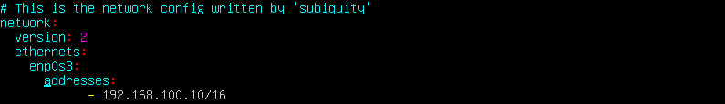
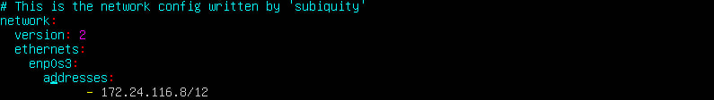

2. С помощью команды `ip a` посмотрим существующие сетевые интерфейсы.

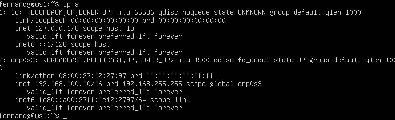
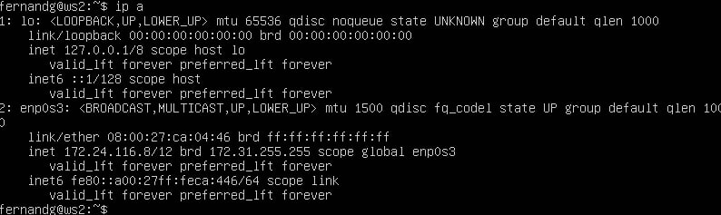

3. Выполним команду `netplan apply` для перезапуска сервиса сети.

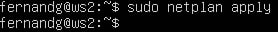

### 2.1. Добавление статического маршрута вручную
С помощью команды `ip r add [IP-адрес] dev enp0s3` (enp0s3 - имя адаптера в моем случае) добавляем статические маршруты от одной машины до другой и обратно, а также пингуем соединение: 

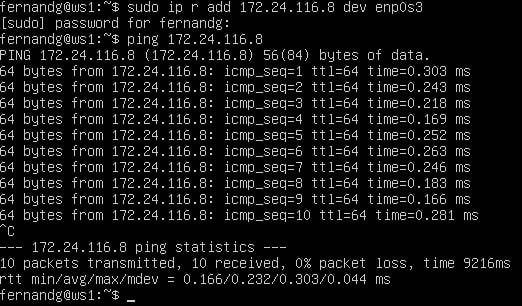
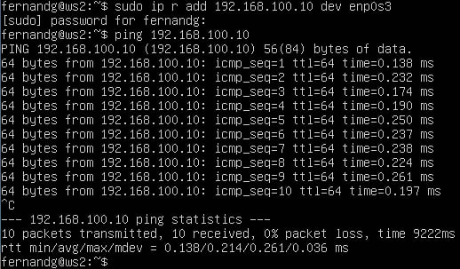

### 2.2. Добавление статического маршрута с сохранением
Перезапустим машины, чтобы пропали наши статические маршруты, созданные с помощью команды `ip r add`.

Если же добавлять маршруты с помощью конфигурационного файла, то они будут сохраняться после перезагрузки.

Добавим статический маршрут от одной машины до другой с помощью файла _/etc/netplan/00-installer-config.yaml_:

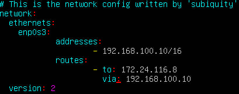
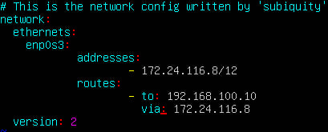

И пропингуем соединение:

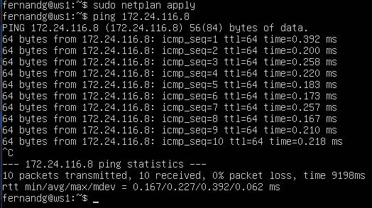
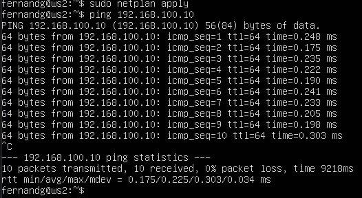

## Part 3. Утилита **iperf3**
### 3.1. Скорость соединения

- 8 Mbps = **1 MB/s**
- 100 MB/s = **800000 Kbps**
- 1 Gbps = **1000 Mbps**

### 3.2. Утилита **iperf3**
Для проверки скорости соединения требуется запустить на одной машине `iperf3 -s`, для того, чтобы запустить *iperf3* в режиме сервера, который будет ожидать соединение от другой машины, а на другой машине требуется запустить `iperf3 -c [IP-адрес]`

Запустим *iperf3* в режиме сервера на **WS1**:

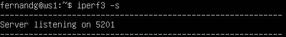

А на второй машине запустим `iperf3 -c 192.168.100.10`:

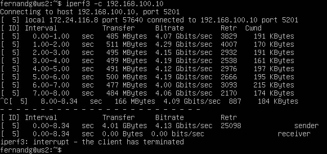

## Part 4. Сетевой экран
### 4.1. Утилита **iptables**

Создадим скрипт */etc/firewall.sh* для каждой машины:
**Для WS1:**

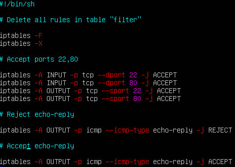

Здесь мы открываем порты **22 - SSH** и **80 - HTTP**, а также применяем стратегию, где в начале пишется запрещающее правило, а в конце пишется разрешающее правило.

**Для WS2:**

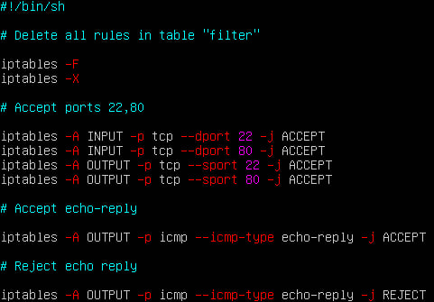

Здесь мы также открываем порты **22** и **80**, но уже применяем стратегию, где в начале  пишется разрешающее правило, а потом запрещающее.

Выдача прав на исполнение и запуск скриптов:

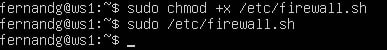
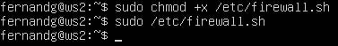

**Разница между стратегиями заключается в том, что в первом файле первым подходящим правилом для пакета является запрет, а во втором - разрешение. Применяется только первое подходящее правило, остальные игнорируются.**

## 4.2. Утилита **nmap**

Предыдущим шагом мы запретили пинговать машину **WS1**, проверим это и запустим утилиту *nmap* командой `nmap [IP-адрес]`:

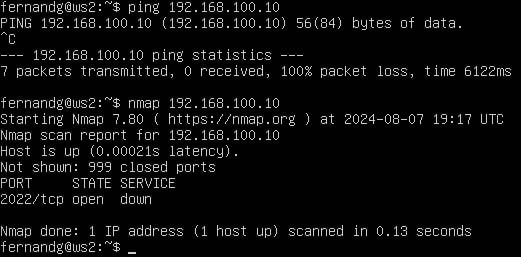

И увидим, что машина действительно не пингуется, при этом утилита *nmap* выдает **Host is up**

На всякий случай проверим, что машина **WS2** пингуется и наши правила работают:

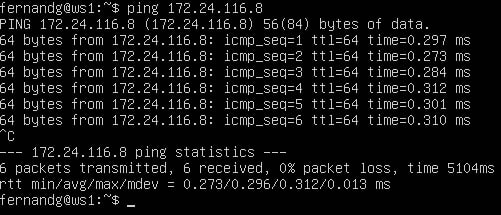

## Part 5. Статическая маршрутизация сети
### 5.1. Настройка адресов машин
Настроим конфигурационный файл *etc/netplan/00-installer-config.yaml* согласно представленной схеме и получим:

Для **WS11**

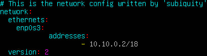

Для **WS21**

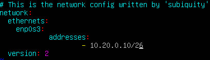

Для **WS22**

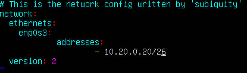

Для **r1**

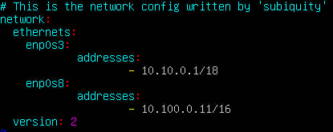

Для **r2**

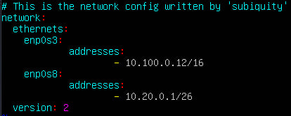

Применим изменения командой `sudo netplan apply`:

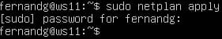
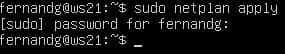
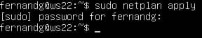
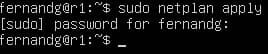
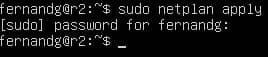

Проверим командой `ip -4 a`, что адрес машины задан верно. Также пропингуем **ws22** с **ws21**. Аналогично пропингуем **r1** с **ws11**.

Для **WS11**

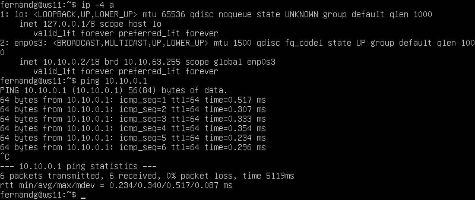

Для **WS21**

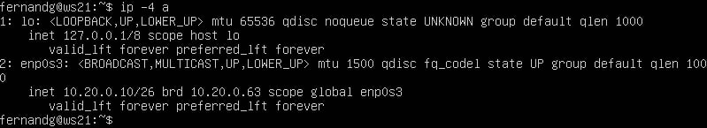

Для **WS22**

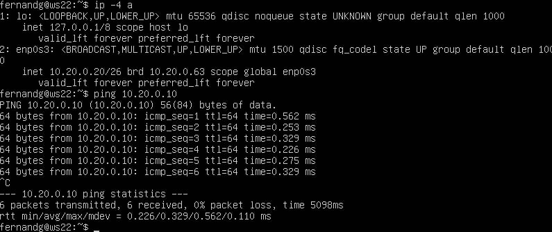

Для **r1**

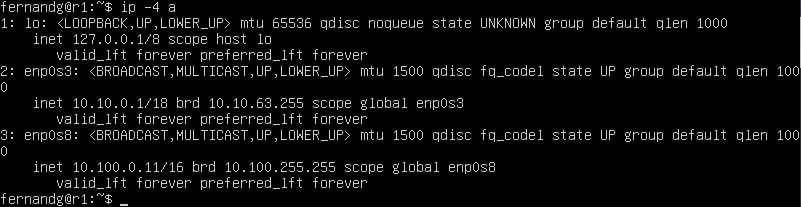

Для **r2**

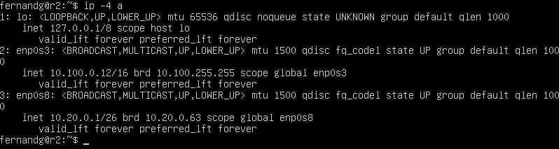

### 5.2. Включение переадресации IP-адресов

Для включения переадресации IP, выполним команду `sysctl -w net.ipv4.ip_forward=1` на роутерах:

Для **r1**

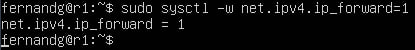

Для **r2**

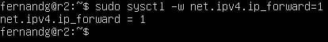

А также откроем файл _/etc/sysctl.conf_ и добавь в него следующую строку:

`net.ipv4.ip_forward = 1`

Для **r1**

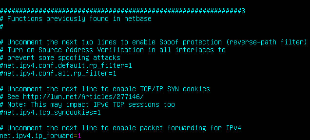

Для **r2**

### 5.3. Установка маршрута по умолчанию

Настроим маршрут по-умолчанию (шлюз) для рабочих станций (**ws11, ws21, ws22**).
Для этого изменим конфигурационный файл *etc/netplan/00-installer-config.yaml*:

Для **WS11**:

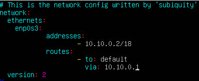

Для **WS21**:

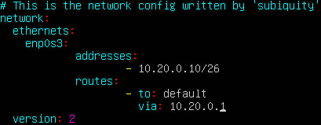

Для **WS22**:

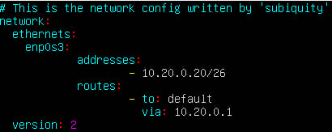

Выполним `ip r` и увидим, что добавился маршрут в таблицу маршрутизации:

Для **WS11**:

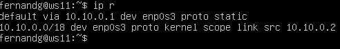

Для **WS21**:

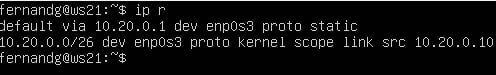

Для **WS22**:

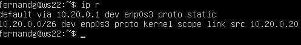

Пропингуем с **WS11** роутер **r2** и на роутере используем команду `tcpdump -tn -i eth0`, чтобы увидеть, что пинг доходит:

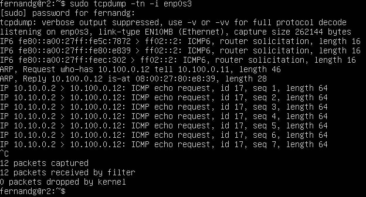

### 5.4. Добавление статических маршрутов

Добавим в роутеры **r1** и **r2** статические маршруты в файле конфигураций:

Для **r1**

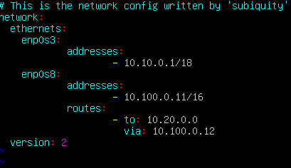

Для **r2**

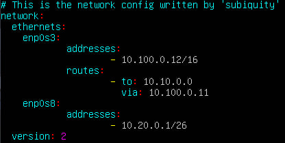

Выполним команду `ip r` на каждом роутере и проверим маршруты:

Для **r1**

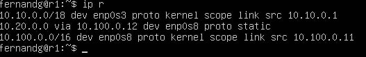

Для **r2**

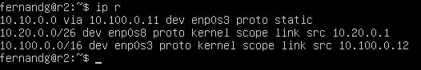

Запустим команды на **ws11**:

`ip r list 10.10.0.0/[маска сети]` и `ip r list 0.0.0.0/0`

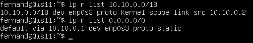

**Для адреса 10.10.0.0/[маска сети] был выбран маршрут, отличный от 0.0.0.0/0 потому что маршрут по умолчанию имеет более низкий приоритет и срабатывает, когда не найден подходящий маршрут в таблице маршрутизации. Для сети 10.10.0.0 мы создали правило, соответственно используется созданный маршрут.**

### 5.5. Построение списка маршрутизаторов

Запустим на **r1** команду дампа `tcpdump -tnv -i eth0` и при помощи **traceroute** построим список маршрутизаторов на пути от **ws11** до **ws21**:

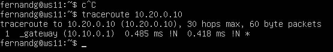

Принцип работы построения пути при помощи **traceroute**:

Для определения промежуточных маршрутизаторов traceroute отправляет серию пакетов данных целевому узлу, при этом каждый раз увеличивая на 1 значение поля TTL («время жизни»). Это поле обычно указывает максимальное количество маршрутизаторов, которое может быть пройдено пакетом. Первый пакет отправляется с TTL, равным 1, и поэтому первый же маршрутизатор возвращает обратно сообщение ICMP, указывающее на невозможность доставки данных. Traceroute фиксирует адрес маршрутизатора, а также время между отправкой пакета и получением ответа (эти сведения выводятся на монитор компьютера). Затем traceroute повторяет отправку пакета, но уже с TTL, равным 2, что позволяет первому маршрутизатору пропустить пакет дальше. Процесс повторяется до тех пор, пока при определённом значении TTL пакет не достигнет целевого узла. При получении ответа от этого узла процесс трассировки считается завершённым.

### 5.6. Использование протокола **ICMP** при маршрутизации

Запустим на **r1** перехват сетевого трафика, проходящего через eth0 с помощью команды:

`tcpdump -n -i eth0 icmp`

Пропингуем с **ws11** несуществующий IP (например, _10.30.0.111_) с помощью команды:

`ping -c 1 10.30.0.111`

## Part 6. Динамическая настройка IP с помощью **DHCP**

Для **r2** настроим в файле _/etc/dhcp/dhcpd.conf_ конфигурацию службы **DHCP**:

В файле _resolv.conf_ пропишем `nameserver 8.8.8.8`:

Перезагрузим службу **DHCP** командой `systemctl restart isc-dhcp-server`:

Перезагрузим машину **ws21** при помощи `reboot` и через `ip a` покажем, что она получила адрес. Также пропингуем **ws22** с **ws21**:

Укажем MAC адрес у ws11, для этого в _etc/netplan/00-installer-config.yaml_ добавим строки: `macaddress: 10:10:10:10:10:BA`, `dhcp4: true`:

Для **r1** настроем аналогично **r2**, но сделаем выдачу адресов с жесткой привязкой к MAC-адресу (ws11):

Скриншоты файлов _resolv.conf_ и _dhcpd.conf_ для роутера **r1**:

Перезагрузим службу **DHCP** на **r1** :

Перезагрузим машину **ws11** и выполним `ip a` и  `ping`:

Для того чтобы обновить ip на **ws21** требуется выполнить 2 команды:

    dhclient -r [DEVICE]
    dhclient [DEVICE]

где DEVICE - название устройства (в моем случае это enp0s3).

Для удобства запишем их обе в одну строчку через **&&**

Исходя из информации на скриншоте увидим, что:
Старый IP - **10.20.0.10**
Новый IP - **10.20.0.3**

В данном пункте использовались данные опции **DHCP**:

- Настройка конфигурации службы **DHCP** (адрес маршрутизатора по умолчанию, DNS-сервер, адрес внутренней сети, привязка к MAC-адресу).

- Клиент протокола динамической конфигурации хоста (команда dhclient) для обновления или освобождения IP-адреса.

## Part 7. **NAT**

В файле _/etc/apache2/ports.conf_ на **ws22** и **r1** изменим строку `Listen 80` на `Listen 0.0.0.0:80`, то есть сделаем сервер Apache2 общедоступным:

Запустим веб-сервер Apache командой `service apache2 start` на ws22 и r1.

Добавим в фаервол, созданный по аналогии с фаерволом из Части 4, на **r2** следующие правила:

Запустим созданный фаервол:

Проверим соединение между **ws22** и **r1** командой `ping`:

Исходя из информации на скриншоте увидим, что соединения **нет**.

Добавим еще одно правило, которое разрешает маршрутизацию **ICMP** пакетов:

Запустим еще раз измененный фаервол:

После этого попробуем еще раз проверить соединение между **ws22** и **r1**:

На этот раз соединение **есть**.

Добавим еще два правила, которые включают **SNAT** и **DNAT**:

Запустим еще раз измененный фаервол:

Проверим соединение по TCP для **SNAT**: для этого с **ws22** подключиться к серверу Apache на **r1** командой`telnet [адрес] [порт]`:

Проверим соединение по TCP для **DNAT**: для этого с **r1** подключиться к серверу Apache на **ws22** командой `telnet` (обращаться будем по адресу **r2** и порту 8080):

## Part 8. Дополнительно. Знакомство с **SSH Tunnels**

Запустим на **r2** фаервол с правилами из Части 7:

Запустим веб-сервер **Apache** на **ws22** только на localhost (то есть в файле _/etc/apache2/ports.conf_ измени строку `Listen 80` на `Listen localhost:80`).

Воспользуемся _Local TCP forwarding_ с **ws21** до **ws22**, чтобы получить доступ к веб-серверу на **ws22** с **ws21**.

Для этого выполним команду `ssh -L 1999:localhost:80 fernandg@10.20.0.20`:

Для проверки, сработало ли подключение, перейдем во второй терминал (клавишами Alt + F2) и выполним команду `telnet 127.0.0.1 1999`

Воспользуемся _Remote TCP forwarding_ c **ws11** до **ws22**, чтобы получить доступ к веб-серверу на **ws22** с **ws11**.

Для этого выполним команду `ssh -R 1999:localhost:80 fernandg@10.10.0.2`:

И также проверим сработало ли подключение:

