## Part 1. Готовый докер

Возьмем официальный докер-образ с **nginx** и скачаем его с помощью `docker pull`, а затем проверим его наличие с помощью `docker images`

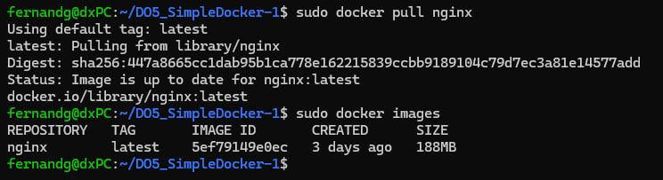

Запустим докер-образ через `docker run -d [image_id|repository]` и проверим, что образ запустился через `docker ps`

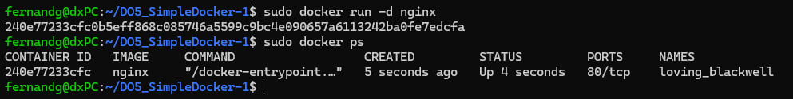

Посмотрим информацию о контейнере через `docker inspect`

**Размер контейнера**

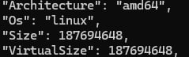

**Список замапленных портов**

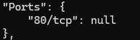

**IP контейнера**

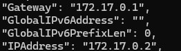

Остановим докер контейнер через `docker stop [container_id|container_name]` и проверим, что контейнер остановился через `docker ps`

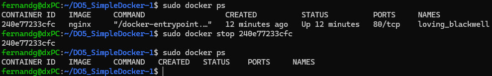

Запустим докер с портами 80 и 443 в контейнере, замапленными на такие же порты на локальной машине, через команду *run*

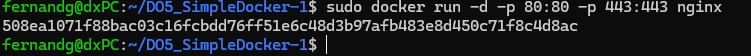

Проверим, что в браузере по адресу *localhost:80* доступна стартовая страница **nginx**.

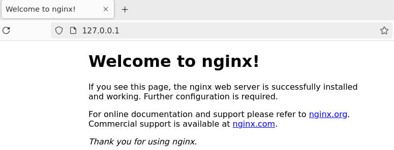

Перезапустим докер контейнер через `docker restart [container_id|container_name]` и  проверим, что он запустился

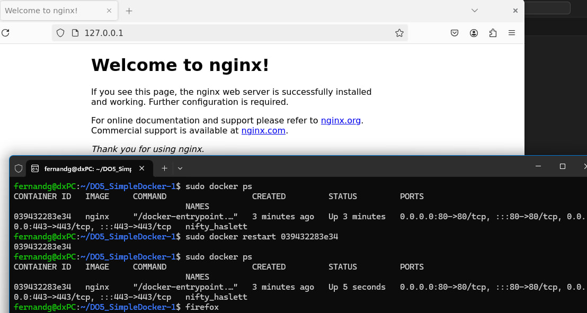

## Part 2. Операции с контейнером

Прочитаем конфигурационный файл *nginx.conf* внутри докер контейнера через команду *exec*.

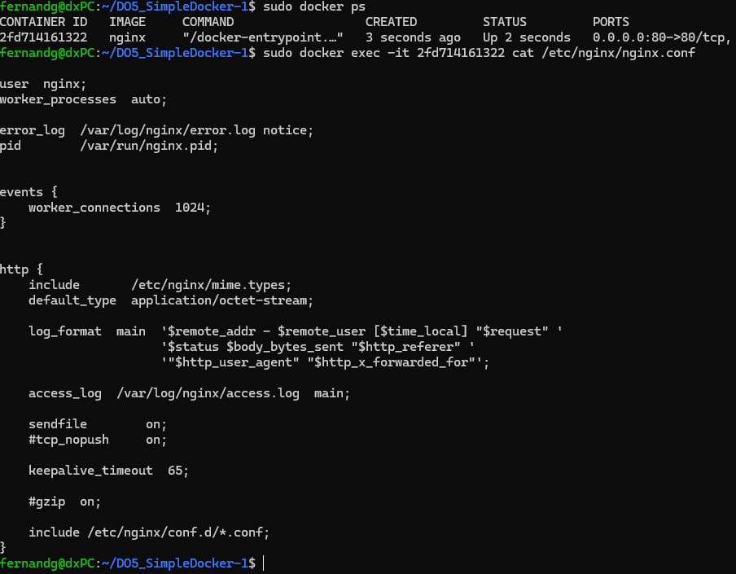

Создадим на локальной машине файл *nginx.conf* и настроим в нем по пути */status* отдачу страницы статуса сервера **nginx**

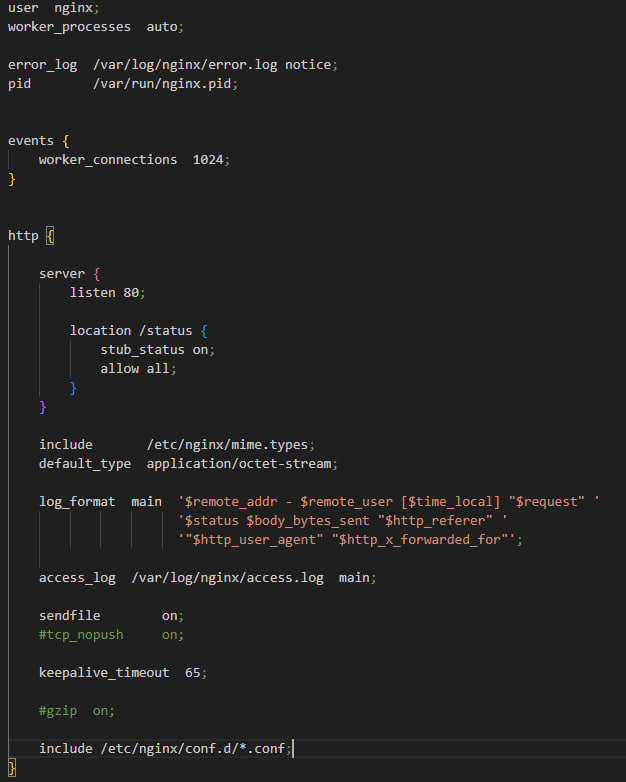

Скопируем созданный файл *nginx.conf* внутрь докер-образа через команду `docker cp`.

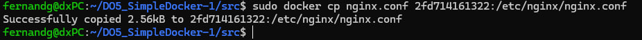

Перезапустим **nginx** внутри докер-образа через команду *exec*

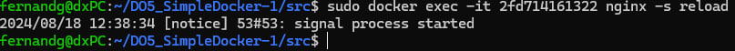

Проверим, что по адресу *localhost:80/status* отдается страничка со статусом сервера **nginx**

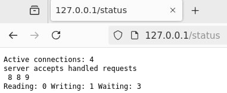

Экспортируем контейнер в файл *container.tar* через команду *export*

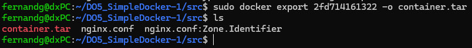

Остановим контейнер

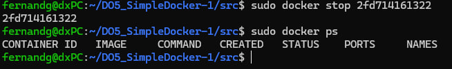

Удалим образ через `docker rmi [image_id|repository]`, не удаляя перед этим контейнеры

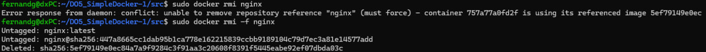

Удалим остановленный контейнер

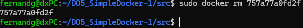

Импортируем контейнер обратно через команду *import*

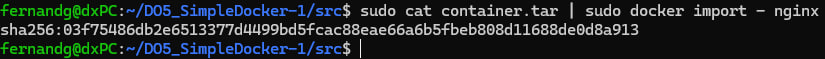

Запустим импортированный контейнер

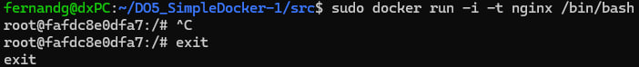

Проверим, что по адресу *localhost:80/status* отдается страничка со статусом сервера **nginx**.

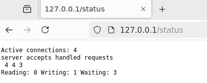

