## Part 1. Настройка **gitlab-runner**

Поднимем виртуальную машину _Ubuntu Server 22.04 LTS_.

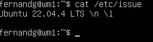

Скачаем и установим на виртуальную машину **gitlab-runner**.

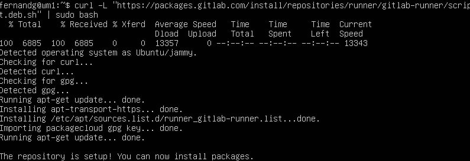
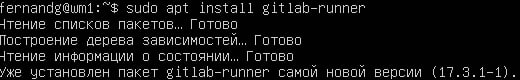

Запустим **gitlab-runner** и зарегистрируй его для использования в текущем проекте (_DO6_CICD_).

Для запуска используем команду `sudo gitlab-runner start`

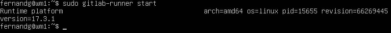

Для регистрации используем команду  `sudo gitlab-runner register` и вводим данные (URL, Token, description и т.д.)

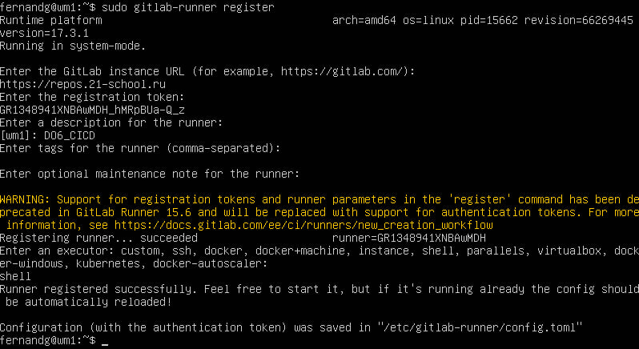

## Part 2. Сборка

В файле _gitlab-ci.yml_ добавим этап запуска сборки через мейк файл из проекта _C2_.

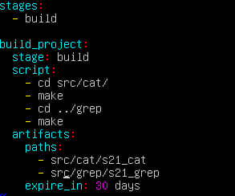

## Part 3. Тест кодстайла

Напишем этап для **CI**, который запускает скрипт кодстайла (_clang-format_).

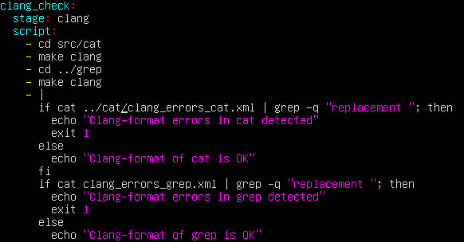

В случае, если кодстайл не проходит проверку, то выдается сообщение:

> Clang-format errors in [cat/grep] detected

И после этого пайплайн фейлится путем завершения скрипта с кодом **1**

В случае, если кодстайл проходит проверку, то выдаются сообщения:

> Clang-format of cat is OK
> Clang-format of grep is OK

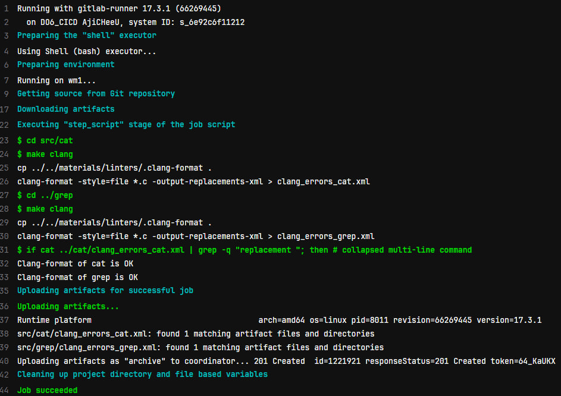

## Part 4. Интеграционные тесты

Напишем этап для **CI**, который запускает твои интеграционные тесты из того же проекта.

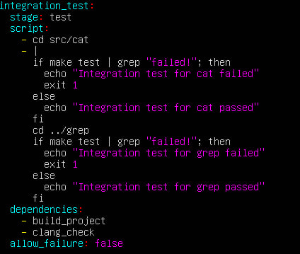

Данный этап запустится только после успешного выполнения предыдущих этапов (сборки и кодстайла) путем добавления в скрипт `dependencies:`

В случае, если тесты не проходят проверку, то выдается сообщение:

> Integration test for [cat/grep] failed

И после этого пайплайн фейлится путем завершения скрипта с кодом **1**

В случае, если тесты проходят проверку, то выдаются сообщения:

> Integration test for cat passed
> Integration test for grep passed

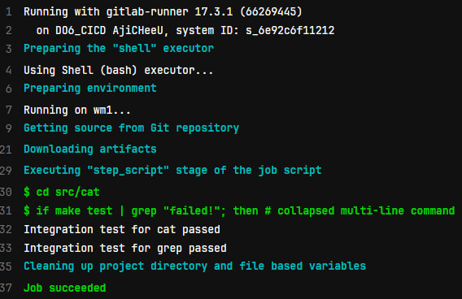

## Part 5. Этап деплоя

Поднимем вторую виртуальную машину _Ubuntu Server 22.04 LTS_.

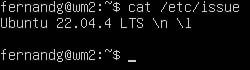

Напишем этап для **CD**, который «разворачивает» проект на другой виртуальной машине.

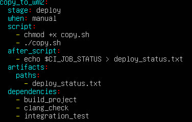

Данный этап запускается вручную путем `when: manual` при условии, что все предыдущие этапы прошли успешно (путем `dependencies`)

Напишем bash-скрипт, который при помощи **ssh** и **scp** копирует файлы, полученные после сборки (артефакты), в директорию _/usr/local/bin_ второй виртуальной машины.

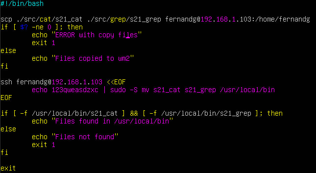

Для того, чтобы при выполнении скрипта не запрашивался пароль для **WM2** скопируем туда ssh-ключ с **WM1**

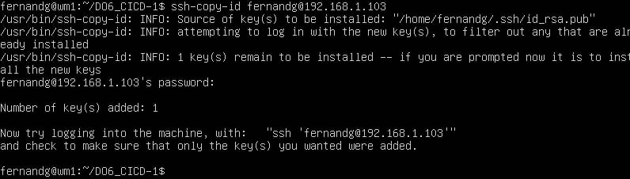

В случае ошибок будет выдаваться сообщение

> ERROR with copy files

или

> Files not found

И после этого будет фейлится пайплайн путем завершения скрипта с кодом **1**

## Part 6. Дополнительно. Уведомления

Напишем следующий этап в файле _.gitlab-ci.yml_:

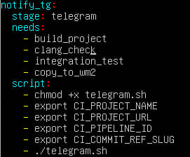

Данный этап требует завершения всех предыдущих этапов путем `needs:`
Берет стандартные переменные из гитлаба (CI_PROJECT_NAME, CI_PROJECT_URL, CI_PIPELINE_ID, CI_COMMIT_RES_SLUG) и запускает скрипт _telegram.sh_

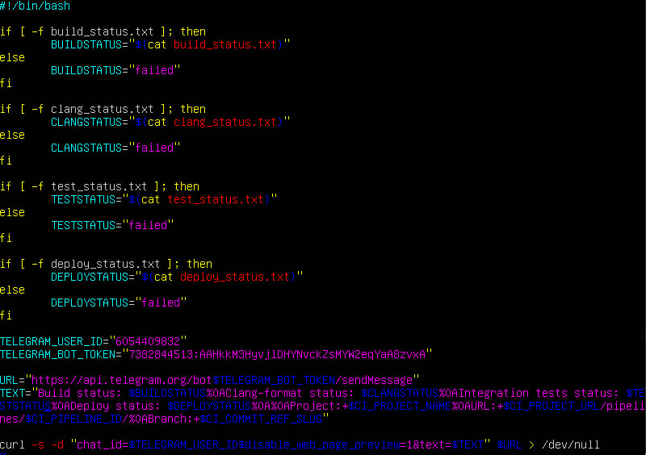

После выполнения данной стадии получаем сообщение через телеграм бота:

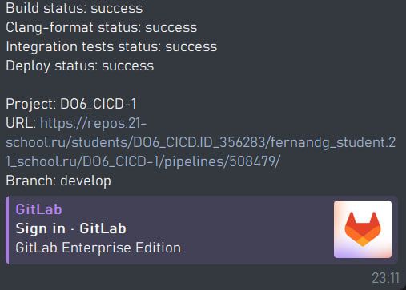